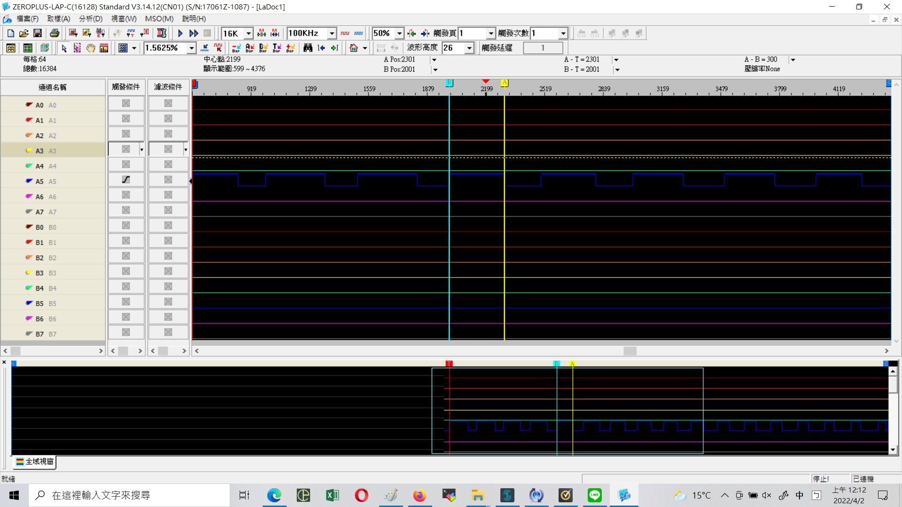
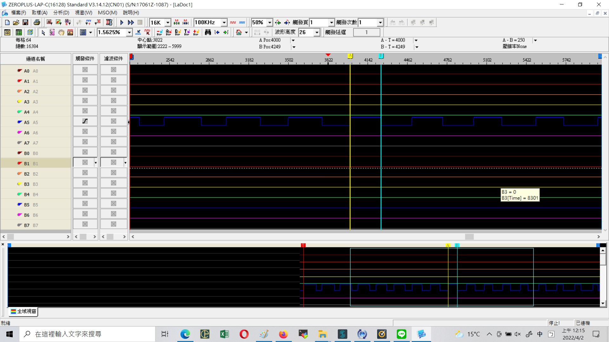

HW5_PWM_Lab
===

# 目標
實作應用到PWM的一些功能，並透過邏輯分析儀觀察輸出波形。  
本次實作內容包含：

1. LED呼吸燈
2. Complementary PWM with Dead Time Insertion（未能實際測試）

# 執行方式
1. 在Mbed Studio中新增一個空白的專案
2. 將main.cpp複製至專案中
3. 選擇stm32l4型號的開發板（因為hal庫的版本）
4. 編譯、運行專案

# 1. LED呼吸燈
## 實作方式
透過快速地調整PWM的Duty Cycle來完成使LED燈明暗變化的功能。本次實作為此撰寫一個專屬的物件，並透過與EventQueue的結合來完成可以多執行緒地進行LED呼吸燈的功能，以方便日後與其他專案的結合與應用。  
可以點擊[影片連結](https://youtube.com/shorts/xA1HAziE5c4)。

## 邏輯分析儀結果

我們實測到的為Duty Cycle正在下降時的波形
由於我們將實測的PWM波形為**2kHz**，並且每兩個週期調整2%的佔寬比，而邏輯分析儀這端設置為**1MHz**（將每個波形分割為500格），因此我們可以看見每兩次波形後佔寬比變化為25格（300->275->250）。

# 2. Complementary PWM with Dead Time Insertion
透過網路上的搜尋與STM32CubeIDE的開發環境的結合，取得一段透過HAL庫設定TIM1_CH1(PA7)與對應TIM1_CH1N(PA8)輸出互補PWM波形的功能，但由於無法實測得PA8腳位的輸出波形，因此無法確定程式是否有正常完成功能，但可以透過這次練習看見如何透過巨集設定對應的暫存器，以完成實際功能的更進階的嵌入式開發方式。